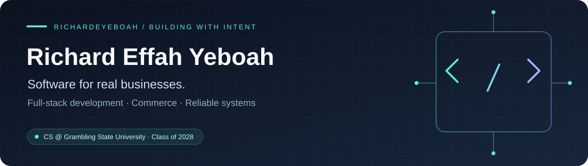

  

  <a href="https://www.linkedin.com/in/richyeff"><strong>LinkedIn</strong></a> &nbsp; / &nbsp;
  <a href="https://kintampoafricanmarket.com"><strong>Live storefront</strong></a> &nbsp; / &nbsp;
  <a href="https://prince-inventory-manager.vercel.app"><strong>POS demo</strong></a>

## Hey, I'm Richard 👋

I'm a **Computer Science student at Grambling State University, graduating in May 2028**, building full-stack applications for commerce and everyday business operations.

I enjoy the engineering behind the interface: validating payments, keeping inventory consistent, making offline retries safe, and testing the workflows people rely on.

**My focus:** TypeScript & React interfaces · Python services · PostgreSQL data integrity

---

## Selected builds

### 🛒 Kintampo African Market
**A production storefront for an African and Caribbean grocery store in Columbus, Ohio.**

- A catalog of **150+ products**, customer accounts, Stripe checkout, local pickup, and nationwide shipping.
- Server-side price validation, payment webhooks, refunds, and staff tools for inventory and fulfillment.
- **61 Playwright tests across 13 files** covering checkout, payment handling, receipts, navigation, and administrative APIs.

`Next.js` `TypeScript` `PostgreSQL` `Supabase` `Stripe` `Playwright`

[Visit the store →](https://kintampoafricanmarket.com) · [Explore the code](https://github.com/richardeyeboah/kintampo-african-market)

### 🔧 Prince Auto Inventory & POS
**Inventory and checkout built around the way a mechanic shop works.**

- Shared stock, parts and labor sales, customer balances, receipts, and reporting.
- Atomic database operations keep sales, stock changes, and financial records together.
- Offline sales sync after reconnection; idempotent retries prevent duplicate sales.

`React` `TypeScript` `Vite` `PostgreSQL` `Supabase` `Vitest`

[Open the demo →](https://prince-inventory-manager.vercel.app) · [Explore the code](https://github.com/richardeyeboah/prince-inventory-manager)

### 🌮 Item7 Food Truck
**Customer ordering and staff operations in one Flask application.**

- Menu browsing, ordering, and order tracking.
- Staff scheduling, shift tracking, and menu management.
- Role-based access for customers, staff, and administrators.

`Python` `Flask` `PostgreSQL` `SQLAlchemy` `JavaScript`

[Open the demo →](https://foodtruckk.vercel.app) · [Explore the code](https://github.com/richardeyeboah/project-foodtruck)

---

## Tools I work with

**Languages**  
TypeScript · JavaScript · Python · Java · SQL · HTML/CSS

**Applications & APIs**  
React · Next.js · Node.js · Flask · FastAPI · REST APIs

**Data & services**  
PostgreSQL · Supabase · Redis · SQLAlchemy · Stripe

**Testing & delivery**  
Playwright · Vitest · Git · GitHub Actions · Vercel

## Beyond the code

- Built **5 full-stack AI applications in 7 weeks** during the Headstarter fellowship.
- Worked on distributed storage with **Java, gRPC, RocksDB, and Raft**.
- Support peers through **ColorStack and NSBE** study groups, coding workshops, and interview preparation.

---

  <strong>Interested in full-stack and backend software engineering internships.</strong> 
  <a href="https://www.linkedin.com/in/richyeff">Let's connect on LinkedIn ↗</a>

